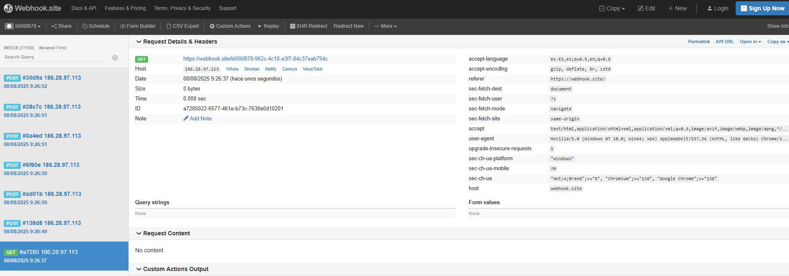
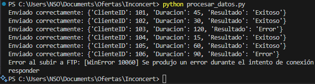

# Prueba Técnica Inconcert:

## Sección 1 : Sentencias SQL

1.1. Consulta que liste, por cada agente, el número total de interacciones y la duración media de llamadas:

```sql
SELECT   a.AgenteID,  a.Nombre,  COUNT(i.InteraccionID) AS TotalInteracciones, AVG(i.Duracion) AS DuracionMedia FROM Agentes a LEFT JOIN Interacciones i ON a.AgenteID = i.AgenteID GROUP BY a.AgenteID, a.Nombre;

```

1.2. Identificar clientes con más de 5 interacciones en el último mes, ordenados por la duración total de llamadas:

```sql
SELECT    c.ClienteID,   c.Nombre,  COUNT(i.InteraccionID) AS TotalInteracciones, SUM(i.Duracion) AS DuracionTotal FROM Clientes c JOIN Interacciones i ON c.ClienteID = i.ClienteID WHERE i.Fecha >= DATE_SUB(NOW(), INTERVAL 1 MONTH) GROUP BY c.ClienteID, c.Nombre HAVING COUNT(i.InteraccionID) > 5 ORDER BY DuracionTotal DESC;
```

1.3. Asignar un ranking a los agentes según el número de interacciones y listar los 10 primeros:

```sql
SELECT    a.AgenteID,   a.Nombre,   COUNT(i.InteraccionID) AS TotalInteracciones, RANK() OVER (ORDER BY COUNT(i.InteraccionID) DESC) AS Ranking FROM Agentes a LEFT JOIN Interacciones i ON a.AgenteID = i.AgenteID GROUP BY a.AgenteID, a.Nombre ORDER BY Ranking LIMIT 10;
```

## Sección 2 : JavaScript Nativo - Implementación de lista de tareas

### Análisis de requisitos:

1. Se necesita una estructura de datos para almacenar tareas.
2. Cada tarea debe tener título, prioridad y estado de completado.
3. Se requiere crear, añadir, filtrar y marcar tareas.
4. También debe generarse un resumen estadístico.

- Solución:
  - Se utiliza una clase Tarea para representar cada tarea.
  - Se usa un array para almacenar todas las instancias de tareas.
  - Se crean funciones auxiliares para crear, filtrar, marcar y resumir.
  - El código es modular, reutilizable y fácil de leer.

```js
// 1.  Clase Tarea (Tpítulo, prioridad, completada = false)
class Tarea {
  constructor(titulo, prioridad) {
    this.titulo = titulo;
    this.prioridad = prioridad.toLowerCase(); // alta, media, baja
    this.completada = false;
  }

  marcarComoCompletada() {
    this.completada = true;
  }
}

// Lista de tareas (estructura contenedora)
const listaTareas = [];

// 2. Función para crear y añadir una tarea
function crearTarea(titulo, prioridad) {
  const nuevaTarea = new Tarea(titulo, prioridad);
  listaTareas.push(nuevaTarea);
}

// 2. Función para filtrar tareas por prioridad
function filtrarPorPrioridad(prioridad) {
  return listaTareas.filter((t) => t.prioridad === prioridad.toLowerCase());
}

// 3. Función para marcar como completada por índice
function marcarCompletada(index) {
  if (listaTareas[index]) {
    listaTareas[index].marcarComoCompletada();
  }
}

// 4. Función para obtener un resumen estadistico de las tareas
function resumenTareas() {
  const total = listaTareas.length;
  const completadas = listaTareas.filter((t) => t.completada).length;
  const porPrioridad = {
    alta: listaTareas.filter((t) => t.prioridad === "alta").length,
    media: listaTareas.filter((t) => t.prioridad === "media").length,
    baja: listaTareas.filter((t) => t.prioridad === "baja").length,
  };

  return {
    total,
    completadas,
    porPrioridad,
  };
}
```

### Ejemplo de uso:

```js
crearTarea("Estudiar SQL", "alta");
crearTarea("Leer documentación", "media");
crearTarea("Ir al gimnasio", "baja");

marcarCompletada(0);

console.log(filtrarPorPrioridad("alta")); // muestra las tareas de prioridad alta
console.log(resumenTareas());
```

## Sección 3: Bloque completo de dialplan (Asterisk PBX)

```ini
[from-trunk]
exten => 900123456,1,Answer()                             ; 1. Contestar la llamada
 same => n,Background(welcome-msg)                        ; 2. Reproducir mensaje de bienvenida
 same => n,WaitExten(5)                                   ; 3. Esperar 5 segundos a que se marque una extensión

exten => 1,1,Dial(SIP/ventas,20)                          ; 4. Si marcan 1, llamar a ventas por 20 segundos
 same => n,Playback(no-agentes)                           ; 6. Si no contestan, reproducir audio de no disponibles
 same => n,Hangup()

exten => 2,1,Dial(SIP/soporte,20)                         ; 5. Si marcan 2, llamar a soporte por 20 segundos
 same => n,Playback(no-agentes)
 same => n,Hangup()

exten => t,1,Playback(no-agentes)                         ; Si no marcan nada (timeout)
 same => n,Hangup()

```

## Sección 4: Script de python (Procesamiento de CSV, API REST, FTP/SFTP)

### Requerimientos:

1. Lea un archivo CSV con datos de interacciones.

2. Envíe cada fila como un JSON mediante una llamada HTTP POST a una API.

3. Suba el archivo CSV completo a un servidor FTP o SFTP.

4. Implemente manejo de errores y confirmación de subida..

Selecciono Python por experiencia en el lenguaje y claridad en la solucion:

```python
import csv
import json
import requests
import ftplib
from pathlib import Path

# Configuración
CSV_FILE = 'interacciones.csv'
# API_URL = 'https://webhook.site/abcdefg-1234-5678-xxxx-yyyyzzzzzz' # Para prueba con webhook.site
API_URL = 'https://api.ejemplo.com/subir-datos'  # Simulado
FTP_HOST = 'ftp.ejemplo.com'
FTP_USER = 'usuario'
FTP_PASS = 'contraseña'
FTP_DEST_PATH = '/interacciones/interacciones.csv'

# 1. Leer CSV y convertir cada fila a JSON
def leer_csv(filepath):
    datos = []
    with open(filepath, newline='') as csvfile:
        reader = csv.DictReader(csvfile)
        for fila in reader:
            datos.append({
                "ClienteID": int(fila['ClienteID']),
                "Duracion": int(fila['Duracion']),
                "Resultado": fila['Resultado']
            })
    return datos

# 2. Enviar cada fila a la API simulada
def enviar_a_api(data):
    for item in data:
        try:
            response = requests.post(API_URL, json=item)
            response.raise_for_status()
            print(f"Enviado correctamente: {item}")
        except Exception as e:
            print(f"Error al enviar {item}: {e}")

# 3. Subir el CSV a un servidor FTP
def subir_a_ftp(filepath):
    try:
        with ftplib.FTP(FTP_HOST) as ftp:
            ftp.login(FTP_USER, FTP_PASS)
            with open(filepath, 'rb') as f:
                ftp.storbinary(f'STOR {FTP_DEST_PATH}', f)
        print(f"Archivo {filepath} subido exitosamente a FTP.")
    except Exception as e:
        print(f"Error al subir a FTP: {e}")

# 4. Ejecución principal
if __name__ == "__main__":
    if not Path(CSV_FILE).exists():
        print(f"Archivo {CSV_FILE} no encontrado.")
    else:
        datos = leer_csv(CSV_FILE)
        enviar_a_api(datos)
        subir_a_ftp(CSV_FILE)

```

### Cambios en produccion:

1. Encriptar las credenciales.

2. Usar .env o un config externo.

3. Soporte para SFTP (paramiko) si se requiere.

4. Reintentos automáticos para errores temporales.

### Pruebas con Webhook.site:



